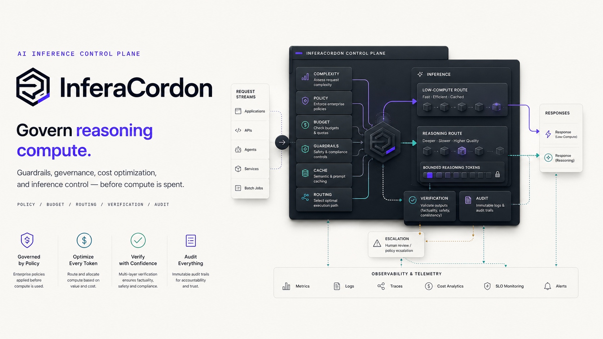
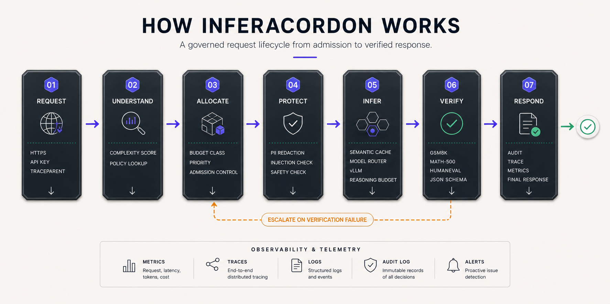
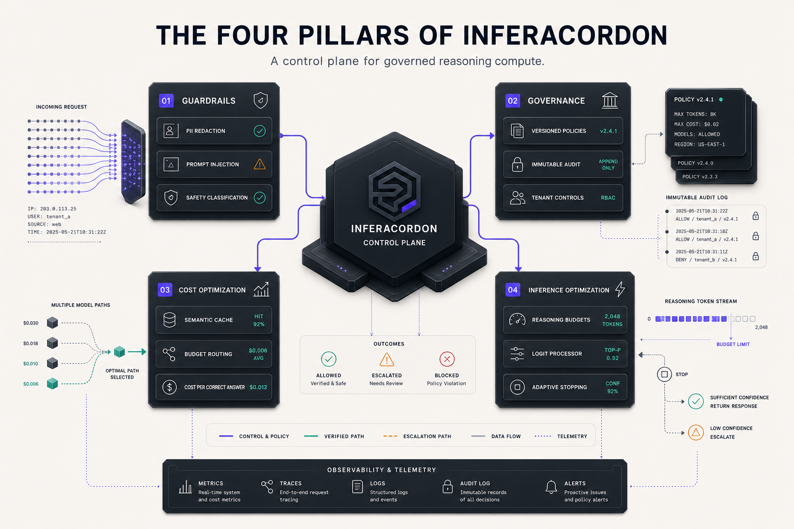
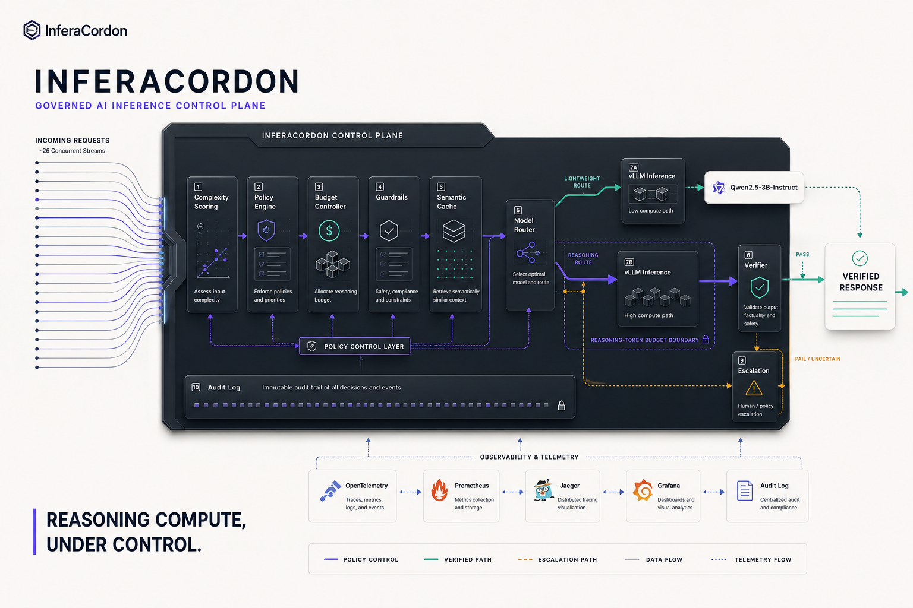
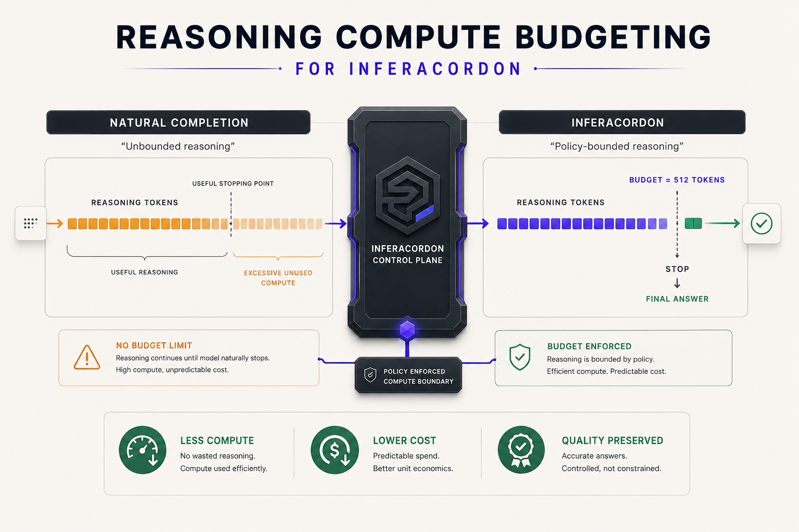
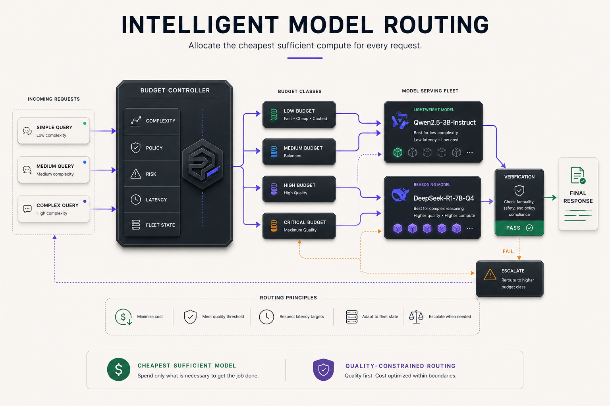

<p align="center">
  
</p>

<h1 align="center">InferaCordon</h1>

<p align="center">
  <strong>Governed AI inference control plane for reasoning models</strong><br>
  Schedulable compute · Policy-bounded budgets · Cost-attributed decisions · Quality-guaranteed outputs
</p>

<p align="center">
  
  
  
  
  
  
</p>

---

<p align="center">
  
</p>

---

## The Problem with Reasoning Models

Modern reasoning models (DeepSeek-R1, o3, QwQ) generate internal chain-of-thought tokens before producing any visible output. Those tokens are **billed in full**, consume context window, dominate inference latency, and are entirely invisible to every standard monitoring, cost attribution, and governance tool in the LLMOps ecosystem. Platform teams have no control surface for this spend.

Three failure modes occur simultaneously in production:

| Failure Mode | What Happens | Why It's Invisible |
|:---|:---|:---|
| **Overthinking** | A model spends 1,800 thinking tokens on a query requiring 200 | No mechanism exists to recognize this and stop earlier |
| **Underthinking** | A complex query hits a conservative global ceiling; shallow answer, no error raised | No per-request budget allocation; no quality enforcement |
| **Budget Blindness** | No per-tenant cost attribution, no SLO-aware routing, no audit trail | Standard observability tools see only output tokens |

InferaCordon treats reasoning tokens as a managed compute resource — exactly like CPU time or memory bandwidth — and builds the control plane that allocates, governs, and attributes them with the same discipline applied to any other bounded resource.

---

<p align="center">
  
</p>

## How InferaCordon Works

Every inference request traverses a 16-step governed pipeline. The seven-stage conceptual lifecycle above maps to these operational steps:

1. **Request** — HTTPS with API key authentication, W3C `traceparent` injection, tenant resolution from `tenants.yaml`
2. **Understand** — Heuristic complexity scoring (0.0–10.0, five feature groups, <3ms, no ML on the critical path) + in-memory policy lookup
3. **Allocate** — Budget class assignment (`low` / `medium` / `high` / `critical`), priority tier computation, admission control semaphore check
4. **Protect** — PII redaction (Presidio, runs before any downstream component sees the prompt), injection classification (DeBERTa ONNX), input safety check (Llama Guard ONNX)
5. **Infer** — Semantic cache lookup (FAISS cosine similarity, threshold 0.92) → model routing → vLLM with `BudgetLogitProcessor` enforcing the reasoning token ceiling
6. **Verify** — GSM8K exact-match, MATH-500 SymPy symbolic equivalence, HumanEval sandboxed subprocess, JSON schema validation
7. **Respond** — Response delivery, async audit write, background LLM-judge evaluation (GPT-4o-mini, post-response, non-blocking)

A failed verification triggers automatic escalation to the next higher budget class (maximum one retry in the MVP). All retry costs — inference, guardrail, and verifier time — are attributed to the original request. Repeated failure returns the response with `confidence_level: "low"` in the body.

---

## Four Pillars

<p align="center">
  
</p>

### Guardrails

PII redaction runs on every request before any downstream component sees the prompt text, using Microsoft Presidio. Prompt injection detection uses a DeBERTa-v3-small model exported to ONNX with int8 quantization (~30–50ms on CPU). Safety classification uses a Llama Guard 3-1B ONNX variant at input and output. The guardrail service is CPU-only and isolated in its own container — it never touches the GPU, never calls vLLM, and has a defined timeout behavior: input timeout → conservative block (503), output timeout → non-blocking pass with audit event.

### Governance

Each YAML policy carries a monotonically increasing version integer. Every request is traced to the exact `policy_version`, `model_version`, `prompt_version`, `guardrail_version`, `verifier_version`, and `complexity_scorer_version` that governed it. The audit log is append-only JSONL — two records per request (decision before inference, outcome after response delivery). No raw prompt or response text is stored. Policies are validated at gateway startup via Pydantic; the gateway does not start with an invalid policy file.

### Cost Optimization

An in-process FAISS `IndexFlatIP` cache with `all-MiniLM-L6-v2` embeddings (22MB) avoids inference entirely on cache hits. Budget-class routing sends simple queries (`complexity ≤ 3.5`) to `Qwen2.5-3B-Instruct` at zero reasoning tokens and reserves `DeepSeek-R1-7B-Q4` for complex queries. The primary metric is **cost per correct answer** — the only metric that simultaneously reflects inference cost, controller overhead, verification overhead, and answer quality. No Redis. No external cache service.

### Inference Optimization

`BudgetLogitProcessor` is a native vLLM `LogitsProcessor` that enforces per-request reasoning token budgets without invasive PyTorch hooks or CUDA Graph disruption. It counts reasoning tokens, detects natural `</think>` delimiters, and forces the delimiter at the configured ceiling. Each request gets its own processor instance — no shared mutable state. Entropy is logged per token for offline adaptive stopping analysis.

```python
# BudgetLogitProcessor — runs inside vLLM's generation loop, per token
def __call__(self, input_ids: torch.Tensor, scores: torch.Tensor) -> torch.Tensor:
    if self.reasoning_complete:
        return scores                                    # answer phase: no intervention

    self.reasoning_token_count += 1

    if input_ids[-1].item() == self.end_of_thinking_token_id:
        self.reasoning_complete = True                   # model stopped naturally
        return scores

    if self.reasoning_token_count >= self.max_reasoning_tokens:
        scores[:] = -float('inf')                        # force the delimiter
        scores[self.end_of_thinking_token_id] = 100.0
        self.reasoning_complete = True

    return scores
```

Validated against 50 diverse queries × 5 forced positions (25%, 50%, 75%, 100% of budget, natural). A coherence rate below 85% at any forced position triggers fallback to hard `max_tokens` truncation — documented as the implemented approach, not silently papered over.

---

<p align="center">
  
</p>

## Architecture

<p align="center">
  
</p>

The control plane consists of ten coordinated components across seven Docker containers. The gateway is the **only** component that talks directly to clients — it calls every other component, receives results, and makes all decisions. No component has client-facing authority except through the gateway.

### Container Topology

| Container | Port | Runtime | Responsibility |
|:---|:---:|:---|:---|
| **FastAPI Gateway** | 8000 | CPU | Complete 16-step request lifecycle; React SPA static files; in-process FAISS cache; background eval thread pool |
| **vLLM Server** | 8080 | GPU | DeepSeek-R1-7B-Q4 + Qwen2.5-3B-Instruct; `BudgetLogitProcessor` registration; native Prometheus endpoint |
| **Guardrail Service** | 8001 | CPU only | DeBERTa injection classifier + Llama Guard safety classifier via ONNX Runtime |
| **Verifier Service** | 8002 | CPU only | GSM8K regex, MATH-500 SymPy, HumanEval sandboxed subprocess, JSON schema validation |
| **Prometheus** | 9090 | — | Metrics scraping from all services; `ic_` prefix for InferaCordon custom metrics |
| **Grafana** | 3000 | — | Pre-configured unified dashboard — Cost, Quality, Reliability, Performance, Governance |
| **Jaeger** | 16686 | — | OpenTelemetry trace collection via OTLP; per-request trace inspection UI |

> Policy engine runs as a Python library imported in-process by the gateway — not a service. FAISS semantic cache is in-process inside the gateway. No Redis. No Celery. No separate frontend container.

---

## Reasoning Compute Budgeting

<p align="center">
  
</p>

Without a control plane, a model reasons until it decides to stop — or until a blunt global limit interrupts it mid-thought, producing an incoherent truncation. InferaCordon selects a per-request reasoning budget matched to query complexity, then enforces it at the `</think>` delimiter boundary rather than at a hard token cutoff.

### Budget Classes

| Class | Model | Reasoning Tokens | Output Tokens | Verification |
|:---|:---|---:|---:|:---|
| `low` | Qwen2.5-3B-Instruct | 0 | 256 | none |
| `medium` | DeepSeek-R1-7B-Q4 | 512 | 512 | verifiable only |
| `high` | DeepSeek-R1-7B-Q4 | 1,024 | 1,024 | required |
| `critical` | DeepSeek-R1-7B-Q4 | 2,048 | 1,024 | required |

Complexity scoring maps five feature groups to a 0–10 score in under 3ms with no ML inference: constraint keyword density (tier-weighted vocabulary), structural signals (question count, sentence count, multi-step patterns), technical domain signals (code blocks, LaTeX, formal logic), prompt length, and output format complexity. The scorer is calibrated offline against observed natural-completion token counts using linear regression; weights are committed to the codebase.

---

## Intelligent Model Routing

<p align="center">
  
</p>

The budget controller maps five signals to a budget class: complexity score, policy configuration, risk domain, latency SLO, and current fleet state. Two circuit breakers modulate routing under pressure:

**GPU Pressure Circuit Breaker** — Opens when `vllm:gpu_cache_usage_perc > 90%` for two consecutive scrapes (5s interval). Low-priority requests reroute to `Qwen2.5-3B-Instruct` regardless of budget class. High-priority requests are unaffected.

**Latency Circuit Breaker** — Opens when P99 TTFT exceeds the policy SLO ceiling for three consecutive 30s evaluation windows. All new requests are assigned one budget class lower; `low`-class requests receive 503 with retry guidance.

Both state transitions emit OpenTelemetry span events and Prometheus gauge changes. The System Health frontend page polls the gauge every 10 seconds.

---

<p align="center">
  
</p>

## The InferaCordon Console

A five-page React SPA served as static files by the gateway. Built so the live demo requires no Grafana window — every metric visible in the frontend comes from Prometheus or the gateway API; no fake data.

<p align="center">
  
</p>

**Inference Playground** — Live demo surface. Submit a prompt, watch the stage progress tracker animate through Complexity Scoring → Policy Lookup → Guardrail Check → Inference → Verification → Response. Trace waterfall updates in real time with span durations. Metrics strip shows: budget class pill, reasoning tokens used/allocated, stop reason, verification result, escalation count, total cost USD, end-to-end latency.

**Observability Dashboard** — Five tab panels. Cost: cost per correct answer vs. natural completion baseline; cache hit rate donut; token savings by budget class. Quality: verification pass/fail/escalation rates; rolling LLM-judge score with quality floor line. Reliability: circuit breaker state indicators with transition history; P95 latency sparkline; admission queue gauge. Performance: live GPU and KV-cache gauges updating every 5s; decode throughput; TTFT histogram with P50/P95/P99 markers. Governance: active policy versions per tenant; chronological governance event log.

<p align="center">
  
</p>

**Policy Manager** — Read-only view of all loaded policies. Version diff panel shows structural changes between current and previous version (additions in emerald, removals in rose). Real-time Pydantic schema validation panel — inspection only, no deployment.

**Audit Log Explorer** — Full-featured explorer for the append-only JSONL audit log. Filter by tenant, budget class, stop reason, verification result, escalation count, and date range. Selecting a row expands the complete decision + outcome records, linked trace ID with Jaeger click-through, and the policy version that governed the request.

**System Health** — Live status for all seven containers. Dedicated circuit breaker state indicators. **Failure Injection Panel** (visible only when `DEMO_MODE=true`) — ten buttons, one per documented failure mode, each triggering the defined system response for a single request and streaming results to the UI in real time.

---

## Evaluation Framework

InferaCordon is evaluated against six baselines across five datasets. **Cost per correct answer** is the primary metric — the only measure that simultaneously captures inference cost, controller overhead, verification overhead, and answer quality.

### Six Baselines

| # | Baseline | Description |
|:---:|:---|:---|
| 1 | Natural completion | No budget control, no routing, no stopping |
| 2 | Fixed low budget | 25th-percentile of natural completion token usage |
| 3 | Fixed medium budget | 50th-percentile of natural completion token usage |
| 4 | Policy routing only | No adaptive stopping, no escalation |
| 5 | Policy routing + escalation | No LogitProcessor stopping |
| 6 | **Full InferaCordon** | Routing + LogitProcessor + escalation + circuit breakers + semantic cache |

The system must improve upon Baseline 3 (fixed medium budget) to justify its existence. A disciplined negative ablation result is documented honestly — not omitted.

### Five Datasets

| Dataset | Size | Verification |
|:---|:---:|:---|
| GSM8K | 100 | Exact-match numerical extraction |
| MATH-500 | 100 | Normalized symbolic; SymPy equivalence fallback |
| HumanEval | 50 | Sandboxed subprocess, Pass@1; 2s CPU + 256MB memory limits |
| Enterprise Synthetic | 200 | LLM-judge (GPT-4o-mini); 10% human-reviewed to calibrate judge bias |
| Adversarial | 50 | Correct system behavior (block / log / escalate / fallback), not answer quality |

### Benchmark Results

<!-- METRICS:BEGIN -->
> **Benchmark results pending** — GPU infrastructure required to run `evaluation/benchmark_harness.py`.
> Results will be populated by `evaluation/update_readme_metrics.py` after the first complete evaluation run.
> Numbers below are architecture-contract targets, **not** measured results.

**Portfolio Targets** *(to be replaced by measured values after first benchmark run)*

| Metric | Target |
|:---|:---|
| Cost per correct answer improvement | ≥15% vs. fixed medium budget baseline |
| Reasoning token reduction | 15–30% vs. natural completion |
| Verifiable task accuracy regression | ≤1 percentage point vs. natural completion |
| P95 end-to-end latency | Target 10% improvement over natural completion; no regression allowed |
| Controller overhead | ≤5% of end-to-end request latency |
| Policy violation rate | Zero across all tested scenarios |
| OpenTelemetry trace completeness | ≥99% across all requests |
| Fallback success rate | ≥99% under fault injection across all ten failure modes |
<!-- METRICS:END -->

---

## Quick Start

> **Prerequisites:** Docker Compose v2 · NVIDIA GPU with CUDA · ~80GB VRAM (A100 80GB or equivalent) · Model weights staged on the model volume · ONNX guardrail models staged on the guardrail volume

```bash
git clone https://github.com/hardikgupta/inferacordon
cd inferacordon
cp .env.example .env
# Edit .env: OPENAI_API_KEY for LLM-judge, VLLM_MODEL_PATH, GUARDRAIL_MODEL_PATH
docker compose up
```

| Service | URL |
|:---|:---|
| Gateway API + React Console | http://localhost:8000 |
| Grafana Dashboard | http://localhost:3000 |
| Prometheus Metrics | http://localhost:9090 |
| Jaeger Trace Explorer | http://localhost:16686 |

```bash
# Governed inference request
curl -X POST http://localhost:8000/v1/infer \
  -H "Authorization: Bearer acme-dev-key" \
  -H "Content-Type: application/json" \
  -d '{
    "prompt": "Solve: if 3x + 7 = 22, find x. Show your reasoning step by step.",
    "tenant_id": "acme_corp",
    "domain": "general_qa"
  }'
```

```bash
# Run the benchmark harness against all baselines
python evaluation/benchmark_harness.py --baseline all --dataset gsm8k math humaneval

# Populate the METRICS block above with measured results
python evaluation/update_readme_metrics.py
```

---

## Repository Structure

```
inferacordon/
├── gateway/                       # FastAPI control plane — 18 modules, flat layout
│   ├── main.py                    # App entrypoint, lifespan, route registration
│   ├── pre_inference_pipeline.py  # 16-step pipeline orchestrator, 50ms deadline timer
│   ├── complexity_scorer.py       # 5-feature-group heuristic scorer, <3ms, no ML
│   ├── semantic_cache.py          # FAISS IndexFlatIP + all-MiniLM-L6-v2, in-process
│   ├── model_router.py            # Budget class → model selection
│   ├── escalation_handler.py      # Verification-triggered retry at higher budget class
│   ├── async_eval_worker.py       # Background thread pool; SQLite writes; LLM-judge calls
│   └── ...                        # auth, rate_limiter, admission_control, pii_redactor, ...
├── policy_engine/                 # Python library — imported in-process by gateway
│   ├── loader.py                  # YAML load + Pydantic validation at startup
│   ├── budget_controller.py       # Complexity → budget class; fleet pressure downgrades
│   ├── audit_log.py               # Append-only JSONL, background write thread (queue 1000)
│   └── policies/                  # Versioned YAML policy files per tenant
│       ├── acme_corp_general_qa_v1.yaml
│       └── demo_tenant_v1.yaml
├── vllm_adapter/                  # vLLM integration layer
│   ├── logit_processor.py         # BudgetLogitProcessor — per-request, no shared state
│   ├── circuit_breakers.py        # GPU pressure CB + latency CB; 5s scrape interval
│   └── constants.py               # end_of_thinking_token_id (calibrated in Week 1)
├── guardrail_service/             # CPU-only FastAPI container (port 8001)
│   ├── injection_classifier.py    # DeBERTa-v3-small ONNX int8, ~30–50ms
│   └── safety_classifier.py       # Llama Guard 3-1B ONNX, ~80–120ms
├── verifier_service/              # CPU-only FastAPI container (port 8002)
│   ├── gsm8k_verifier.py          # Exact-match numerical extraction
│   ├── math_verifier.py           # \boxed{} extraction + SymPy symbolic fallback
│   ├── humaneval_runner.py        # Sandboxed subprocess; 2s CPU + 256MB memory limits
│   └── schema_verifier.py         # jsonschema.validate()
├── telemetry/                     # OTel trace schema dataclass; Prometheus ic_ metrics
├── evaluation/                    # Benchmark harness, ablation runner, regression gate
├── load_testing/                  # Locust profiles — 10 / 50 / 100 RPS workloads
├── frontend/                      # React SPA source (Vite; served as static by gateway)
├── tests/                         # 34 test files: unit + integration + failure injection
└── dashboards/grafana/            # Pre-configured unified dashboard JSON
```

---

## Technology Stack

| Layer | Technology | Choice Rationale |
|:---|:---|:---|
| Gateway framework | FastAPI (Python 3.11+) | Async, OpenAPI-native, static file serving, minimal overhead |
| Inference server | vLLM — single instance, multi-model | `LogitsProcessor` API; OpenAI-compatible; native Prometheus endpoint |
| Reasoning model | DeepSeek-R1-7B-Q4 (4-bit AWQ or GPTQ) | Fits A100 80GB alongside cheap model with KV-cache headroom |
| Cheap model | Qwen2.5-3B-Instruct (4-bit) | Minimal cost for low-complexity routing; 0 reasoning tokens |
| Semantic cache | FAISS `IndexFlatIP` + `all-MiniLM-L6-v2` | In-process; 22MB embedding model; no external service |
| PII redaction | Microsoft Presidio | Named-entity recognition; configurable per policy domain |
| Guardrail runtime | ONNX Runtime (DeBERTa int8 + Llama Guard 3-1B) | CPU-only; no GPU competition with inference workload |
| Policy format | YAML + Pydantic validation | Human-readable; startup-validated; versioned; audit-traceable |
| Tracing | OpenTelemetry + Jaeger (OTLP) | W3C `traceparent` propagation; complete per-request lineage |
| Metrics | Prometheus + Grafana | `ic_` prefix; pre-configured dashboard committed to repository |
| Evaluation store | SQLite | LLM-judge results only; not for governance audit records |
| Audit log | Append-only JSONL on Docker volume | Immutable governance artifact; survives container restarts |
| LLM judge | GPT-4o-mini | Async non-verifiable response scoring; never on the response path |
| Frontend | React + Recharts | SPA served as gateway static files; no separate container |
| Orchestration | Docker Compose v2 | `docker compose up` — all seven containers |

---

## Implementation Roadmap

| Weeks | Phase | Key Deliverables | Status |
|:---:|:---|:---|:---:|
| 1–2 | Baseline & Core Validation | vLLM serving both models; LogitProcessor validated; six baselines on GSM8K / MATH-500 / HumanEval; skeleton gateway; complexity scorer calibrated | In progress |
| 3–4 | Policy Engine & Budget Controller | YAML policy engine; audit log; rate limiter; admission control; semantic cache; policy-routing baseline eval | Planned |
| 5–6 | Guardrails & Verifier | Guardrail service container; PII redaction; verifier service; verification-triggered escalation; ablation through escalation layer | Planned |
| 7–8 | Reliability Layer | GPU + latency circuit breakers; all ten failure mode handlers; fault injection tests; 10/50/100 RPS load tests | Planned |
| 9–10 | Complete Observability | Full OTel trace schema; Grafana unified dashboard; async eval worker; SQLite; full benchmark suite | Planned |
| 11–12 | Frontend | Five-page React app; all API integrations; Failure Injection Panel; end-to-end demo scenario testing | Planned |
| 13–14 | Portfolio Packaging | Technical design document; five-minute demo recording; final benchmark run via `update_readme_metrics.py` | Planned |

---

<p align="center">
  
  <br><br>
  <sub>
    One engineer &nbsp;·&nbsp; Fourteen weeks &nbsp;·&nbsp; One GPU node &nbsp;·&nbsp; <code>docker compose up</code>
    <br>
    Architecture contract: <a href="CLAUDE.md">CLAUDE.md</a> &nbsp;·&nbsp; System overview: <a href="architecture.md">architecture.md</a>
  </sub>
</p>
